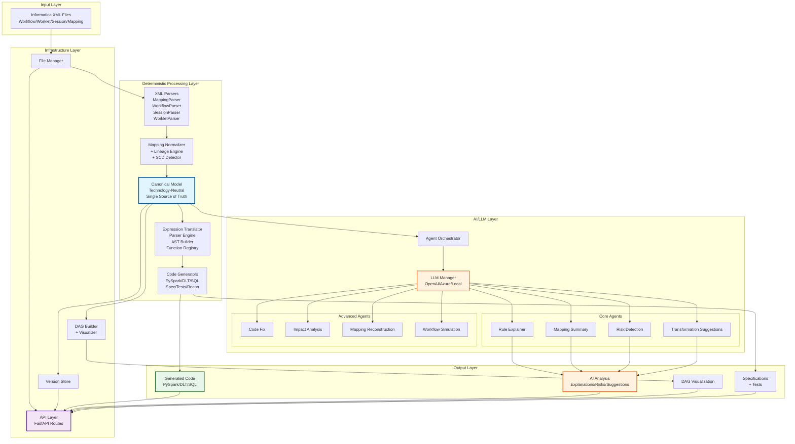

# System Architecture Overview

> **Note**: For a comprehensive solution overview including graph-first architecture, see [`solution.md`](../development/solution.md)

## Purpose & Problem Statement

Legacy Informatica ETL + traditional DW stacks create issues such as:
- Vendor lock-in, operational complexity, slow change velocity
- Poor visibility into business rules encoded in mappings
- Difficulty onboarding new teams
- High migration effort for Lakehouse modernization

This platform provides an **AI-augmented modernization accelerator** that:
1. Reverse-engineers Informatica assets (workflow, worklet, session, mapping XMLs)
2. Converts everything into a normalized, technology-neutral canonical data model
3. Builds complete lineage graphs
4. Generates modern code (PySpark, Delta Live Tables, SQL, specs, tests)
5. Provides deep AI reasoning (summaries, risks, optimizations, code-fix, reconstruction)
6. Enables a near‑zero‑touch migration to Lakehouse architectures

---

## High-Level Architecture

### Logical Flow

At the highest level, the system can be viewed as:

1. **Input**: Informatica XML files (Workflow, Worklet, Session, Mapping)
2. **Parsing**: Structured extraction of transformations, fields, connectors, and configuration
3. **Canonical Modeling**: Normalization into a technology-neutral representation
4. **Expression Processing**: Building ASTs from Informatica expressions and translating them
5. **Code & Spec Generation**: PySpark/SQL/DLT/specs/reconciliation/tests
6. **AI & LLM Reasoning**: Explanation, summarization, risk analysis, optimization, reconstruction
7. **DAG Construction**: Building workflow-level execution graphs
8. **Delivery**: Through REST API, UI, files, and integration with catalogs/storage/CI

### Textual Architecture Diagram

```text
Informatica XMLs
  (Workflow / Worklet / Session / Mapping)
                 |
                 v
          [ XML Parsers ]
                 |
                 v
      [ Canonical Model + Lineage ]
                 |
                 v
      [ Expression AST Engine ]
                 |
                 v
      [ Code Generators ]
   (PySpark / SQL / DLT / Specs / Tests)
                 |
                 v
      [ AI & LLM Agents Layer ]
                 |
                 v
        [ Workflow DAG Engine ]
                 |
                 v
     [ API + UI + Deployment Layer ]
```

### Component Overview

#### Input Layer
- **XML Files**: Workflow, Worklet, Session, Mapping XML files from Informatica

#### Processing Layer
- **XML Parsers**: Extract structured data from XML
- **Canonical Model**: Technology-neutral representation
- **Expression Engine**: Parse and translate expressions
- **Code Generators**: Generate target platform code

#### Intelligence Layer
- **AI Agents**: LLM-powered analysis and reasoning
- **DAG Engine**: Workflow execution graph construction

#### Delivery Layer
- **Backend API**: RESTful API for programmatic access
- **Frontend UI**: Interactive web interface
- **Deployment**: Docker, Kubernetes, CI/CD integration

### Data Flow

1. **XML → Parsed Data**: XML parsers extract structured information
2. **Parsed Data → Canonical Model**: Normalization ensures consistency
3. **Canonical Model → Code**: Generators produce executable artifacts
4. **Canonical Model → AI Insights**: Agents provide analysis and recommendations
5. **Workflow XML → DAG**: DAG engine constructs execution graphs
6. **All → API/UI**: Results delivered through interfaces

### Key Design Principles

1. **Modularity**: Each component is independent and replaceable
2. **Canonical Model**: Single source of truth for all downstream processing
3. **Extensibility**: Easy to add new parsers, generators, or agents
4. **AI-Augmented**: LLMs enhance but don't replace deterministic logic
5. **Regeneration-Friendly**: Code can be regenerated from design specs

---

## a) Overview

The **Informatica Modernization Accelerator** is an AI-augmented platform that reverse-engineers legacy Informatica ETL workloads and modernizes them into lakehouse-native architectures (PySpark, Delta Live Tables, SQL on Databricks/Spark).

The system follows a **two-part architecture with graph-first storage**:

1. **Deterministic Layer**: Core parsing, normalization, translation, and code generation components that produce reliable, reproducible outputs
2. **AI/LLM Layer**: Intelligent agents that provide explanations, analysis, suggestions, and reasoning capabilities

This separation ensures that:
- **Deterministic components** handle the critical path of modernization (parsing → canonical model → code generation)
- **AI agents** enhance the experience with insights, explanations, and recommendations
- The system works even without LLM access, but is significantly enhanced with it

---

## b) Components and Their Responsibilities

### Deterministic Components

#### 1. **Parsers** (`src/parser/`)
**Purpose**: Extract structured data from Informatica XML files

**Components**:
- `mapping_parser.py`: Parses Mapping XML files
- `workflow_parser.py`: Parses Workflow XML files
- `session_parser.py`: Parses Session XML files
- `worklet_parser.py`: Parses Worklet XML files
- `reference_resolver.py`: Resolves references between objects

**Responsibilities**:
- Parse XML structure into Python dictionaries
- Extract transformations, fields, connectors, attributes
- Handle Informatica-specific XML formats
- Resolve cross-references between objects
- Validate XML structure

**Output**: Raw parsed data (Python dictionaries)

---

#### 2. **Normalizer** (`src/normalizer/`)
**Purpose**: Convert raw parsed data into a technology-neutral canonical model

**Components**:
- `mapping_normalizer.py`: Main normalizer that orchestrates the process
- `lineage_engine.py`: Builds data lineage graphs
- `scd_detector.py`: Detects Slowly Changing Dimension patterns
- `model_serializer.py`: Serializes canonical models

**Responsibilities**:
- Normalize all transformation types (Source, Expression, Lookup, Aggregator, Join, Router, Filter, Union)
- Build complete data lineage (field-level and transformation-level)
- Detect SCD patterns (Type 1, Type 2, Type 3)
- Extract business rules and relationships
- Create a single source of truth for all downstream processing

**Output**: Canonical Model (JSON structure)

---

#### 3. **Translator** (`src/translator/`)
**Purpose**: Translate Informatica expressions to target platform syntax

**Components**:
- `parser_engine.py`: Parses Informatica expressions into AST
- `tokenizer.py`: Tokenizes expression strings
- `ast_nodes.py`: Defines AST node types
- `pyspark_translator.py`: Translates AST to PySpark code
- `sql_translator.py`: Translates AST to SQL
- `function_registry.py`: Maps Informatica functions to target platform functions

**Responsibilities**:
- Parse Informatica expressions (IIF, DECODE, NVL, etc.)
- Build Abstract Syntax Trees (AST)
- Translate 100+ Informatica functions to PySpark/SQL equivalents
- Handle operator precedence and parentheses
- Support port references, variable references, and system variables

**Output**: Translated expressions in target platform syntax

---

#### 4. **Generators** (`src/generators/`)
**Purpose**: Generate executable code from canonical models

**Components**:
- `pyspark_generator.py`: Generates PySpark DataFrame code
- `dlt_generator.py`: Generates Delta Live Tables pipelines
- `sql_generator.py`: Generates SQL scripts
- `spec_generator.py`: Generates mapping specifications
- `tests_generator.py`: Generates unit tests
- `recon_generator.py`: Generates reconciliation scripts

**Responsibilities**:
- Generate complete, executable code from canonical models
- Handle all transformation types
- Produce idiomatic code for target platforms
- Include error handling and logging
- Generate test data and validation scripts

**Output**: Generated code files (Python, SQL, Markdown)

---

#### 5. **DAG Builder** (`src/dag/`)
**Purpose**: Build execution graphs for workflows

**Components**:
- `dag_builder.py`: Main DAG construction logic
- `dag_models.py`: DAG data structures
- `dag_visualizer.py`: Visualization utilities

**Responsibilities**:
- Build execution DAGs from workflow definitions
- Perform topological sorting
- Detect cycles and dependencies
- Identify critical paths
- Support visualization (Mermaid, DOT, JSON)

**Output**: DAG structure (nodes, edges, execution order)

---

### AI/LLM Components

#### 6. **LLM Infrastructure** (`src/llm/`)
**Purpose**: Provide unified interface to multiple LLM providers

**Components**:
- `llm_manager.py`: Main LLM manager that routes requests with intelligent fallback
- `openai_client.py`: OpenAI API client
- `azure_openai_client.py`: Azure OpenAI client
- `local_llm_client.py`: Local LLM client (Ollama, vLLM, mock)
- `prompt_templates.py`: Prompt templates for all agents

**Responsibilities**:
- Abstract LLM provider differences
- Handle retry logic and error handling
- Manage prompt templates
- Support multiple providers (OpenAI, Azure, Local)
- Provide intelligent fallback mechanisms:
  - OpenAI → Local LLM (if OpenAI fails)
  - Local LLM → OpenAI (if Local fails)
  - Azure → OpenAI (if Azure fails)
- Enable response caching for performance

**Configuration**:
- Set `LLM_PROVIDER` environment variable: `openai`, `azure`, or `local`
- For local: Configure `OLLAMA_URL` (default: `http://localhost:11434`) and `OLLAMA_MODEL` (default: `llama3`)
- See `docs/getting-started/setup_neo4j.md` for LLM configuration details

**Output**: LLM responses (text/JSON)

---

#### 7. **AI Agents** (`ai_agents/`)
**Purpose**: Provide intelligent analysis and recommendations

**Core Agents**:
- `rule_explainer_agent.py`: Explains Informatica expressions in business terms
- `mapping_summary_agent.py`: Generates comprehensive narrative summaries
- `risk_detection_agent.py`: Identifies potential issues and risks
- `transformation_suggestion_agent.py`: Suggests optimizations and modernizations

**Advanced Agents**:
- `code_fix_agent.py`: Automatically fixes errors in generated code
- `impact_analysis_agent.py`: Analyzes downstream impact of changes
- `mapping_reconstruction_agent.py`: Reconstructs mappings from partial information
- `workflow_simulation_agent.py`: Simulates execution and identifies bottlenecks

**Orchestration**:
- `agent_orchestrator.py`: Coordinates multiple agents with error handling and caching

**Responsibilities**:
- Analyze canonical models and expressions
- Generate explanations and summaries
- Detect risks and suggest improvements
- Provide actionable recommendations
- Handle errors gracefully with fallbacks

**Output**: Analysis results (JSON structures with explanations, risks, suggestions)

---

### Infrastructure Components

#### 8. **Graph Store** (`src/graph/`)
**Purpose**: Neo4j-based graph storage for canonical models and lineage

**Components**:
- `graph_store.py`: Neo4j integration for storing mappings, transformations, and lineage
- `graph_queries.py`: High-level query interface for graph operations
- `graph_sync.py`: Synchronization between JSON version store and graph

**Responsibilities**:
- Store canonical models as graph nodes and relationships
- Build and maintain data lineage graphs
- Enable graph-first architecture (optional, configurable)
- Support complex queries (migration order, readiness assessment, pattern detection)
- Provide graph-based assessment and analysis capabilities

**Configuration**:
- Set `ENABLE_GRAPH_STORE=true` in `.env` to enable graph features
- Configure Neo4j connection: `NEO4J_URI`, `NEO4J_USER`, `NEO4J_PASSWORD`
- Set `GRAPH_FIRST=true` to prefer graph store over file-based storage
- See `docs/getting-started/setup_neo4j.md` for Neo4j setup instructions

**Features**:
- Stores mappings, transformations, sources, targets as nodes
- Builds relationships: lineage, dependencies, data flow
- Supports assessment: migration readiness, complexity analysis, wave planning
- Enables graph-based queries and pattern detection

---

#### 9. **API Layer** (`src/api/`)
**Purpose**: RESTful API for programmatic access

**Components**:
- `app.py`: FastAPI application setup
- `routes.py`: API endpoint definitions
- `file_manager.py`: File upload and management
- `models.py`: Request/response models
- `hierarchy_builder.py`: Builds component hierarchies

**Responsibilities**:
- Expose all functionality via REST API
- Handle file uploads and storage
- Orchestrate parsing, generation, and AI analysis
- Provide error handling and validation
- Support versioning and caching
- Integrate with graph store when enabled

**Endpoints**:
- `/upload`: File upload
- `/parse/*`: Parsing endpoints
- `/generate/*`: Code generation endpoints
- `/analyze/*`: AI analysis endpoints
- `/dag/*`: DAG building endpoints
- `/graph/*`: Graph store endpoints (when enabled)

---

#### 10. **Version Store** (`src/versioning/`)
**Purpose**: Store and version canonical models and generated artifacts

**Components**:
- `version_store.py`: Version storage implementation with optional graph integration

**Responsibilities**:
- Store canonical models (JSON-based or graph-based)
- Version generated artifacts
- Enable regeneration from stored models
- Support rollback and comparison
- Integrate with graph store when `GRAPH_FIRST=true`

**Storage Modes**:
- **File-based**: Default mode, stores JSON files in `versions/` directory
- **Graph-first**: When `GRAPH_FIRST=true`, uses Neo4j as primary storage with JSON fallback

---

#### 11. **Assessment Components** (`src/assessment/`)
**Purpose**: Pre-migration assessment and analysis

**Components**:
- `profiler.py`: Profiles mappings and transformations
- `analyzer.py`: Analyzes patterns and migration blockers
- `wave_planner.py`: Plans migration waves
- `report_generator.py`: Generates assessment reports
- `tco_calculator.py`: Calculates total cost of ownership

**Responsibilities**:
- Analyze migration complexity
- Identify migration blockers and risks
- Plan migration waves and dependencies
- Generate comprehensive assessment reports
- Calculate TCO and effort estimates

**Requirements**: Requires graph store to be enabled (`ENABLE_GRAPH_STORE=true`)

---

#### 12. **Utilities** (`src/utils/`)
**Purpose**: Shared utilities and helpers

**Components**:
- `logger.py`: Structured logging infrastructure (JSON/text format)
- `exceptions.py`: Custom exception classes
- `file_utils.py`: File operations
- `validators.py`: Validation utilities
- `error_categorizer.py`: Categorizes and handles errors
- `error_recovery.py`: Error recovery mechanisms

---

## c) How Components Work Together at Different Stages

### Stage 1: File Upload and Parsing

```
User uploads XML file
    ↓
File Manager saves file
    ↓
Parser (Mapping/Workflow/Session/Worklet) extracts structured data
    ↓
Raw parsed data stored in memory/version store
```

**Components Involved**:
- `FileManager`: Handles file upload and storage
- `MappingParser` / `WorkflowParser` / `SessionParser` / `WorkletParser`: Parse XML
- `ReferenceResolver`: Resolve cross-references

**Output**: Raw parsed data (Python dictionaries)

---

### Stage 2: Normalization and Canonical Model Creation

```
Raw parsed data
    ↓
MappingNormalizer normalizes transformations
    ↓
LineageEngine builds data lineage
    ↓
SCDDetector detects Slowly Changing Dimensions
    ↓
Canonical Model created
    ↓
Stored in Version Store (file-based or graph-based)
    ↓
[Optional] Stored in Graph Store (if ENABLE_GRAPH_STORE=true)
```

**Components Involved**:
- `MappingNormalizer`: Orchestrates normalization
- `LineageEngine`: Builds lineage graphs
- `SCDDetector`: Detects SCD patterns
- `VersionStore`: Stores canonical model (file or graph)
- `GraphStore`: Stores in Neo4j (if enabled)

**Output**: Canonical Model (single source of truth)
- File-based: JSON files in `versions/` directory
- Graph-based: Neo4j nodes and relationships (if enabled)

---

### Stage 3: Expression Translation

```
Canonical Model (with Informatica expressions)
    ↓
ParserEngine parses expressions into AST
    ↓
PySparkTranslator / SQLTranslator translates AST
    ↓
Translated expressions ready for code generation
```

**Components Involved**:
- `ParserEngine`: Parses expressions
- `Tokenizer`: Tokenizes expression strings
- `PySparkTranslator` / `SQLTranslator`: Translates to target syntax
- `FunctionRegistry`: Maps Informatica functions

**Output**: Translated expressions (PySpark/SQL syntax)

---

### Stage 4: Code Generation

```
Canonical Model + Translated Expressions
    ↓
Generator (PySpark/DLT/SQL/Spec/Tests) generates code
    ↓
Complete executable code files
    ↓
Stored in generated_code/ directory
```

**Components Involved**:
- `PySparkGenerator`: Generates PySpark code
- `DLTGenerator`: Generates Delta Live Tables pipelines
- `SQLGenerator`: Generates SQL scripts
- `SpecGenerator`: Generates specifications
- `TestsGenerator`: Generates unit tests

**Output**: Generated code files

---

### Stage 5: AI Analysis (Parallel to Code Generation)

```
Canonical Model
    ↓
AgentOrchestrator coordinates agents
    ↓
LLMManager (with fallback: OpenAI → Local LLM)
    ↓
┌─────────────────────────────────────┐
│  Core Agents (can run in parallel)  │
├─────────────────────────────────────┤
│ • RuleExplainerAgent                 │
│ • MappingSummaryAgent                │
│ • RiskDetectionAgent                 │
│ • TransformationSuggestionAgent      │
└─────────────────────────────────────┘
    ↓
Advanced Agents (as needed)
    ↓
Aggregated analysis results
```

**Components Involved**:
- `AgentOrchestrator`: Coordinates agents
- `LLMManager`: Provides LLM access with intelligent fallback
- All AI Agents: Perform analysis
- `PromptTemplates`: Provide prompts

**LLM Fallback Logic**:
- Primary provider fails → Falls back to alternative
- OpenAI fails → Local LLM (Ollama)
- Local LLM fails → OpenAI (if configured)
- All fail → Error with graceful handling

**Output**: Analysis results (explanations, summaries, risks, suggestions)

---

### Stage 6: DAG Construction (for Workflows)

```
Workflow parsed data
    ↓
DAGBuilder extracts tasks and links
    ↓
Builds node and edge structures
    ↓
Performs topological sorting
    ↓
Detects cycles and dependencies
    ↓
DAG structure with execution order
    ↓
DAGVisualizer creates visualizations
```

**Components Involved**:
- `DAGBuilder`: Builds DAG structure
- `DAGVisualizer`: Creates visualizations

**Output**: DAG structure (JSON, Mermaid, DOT)

---

### Stage 7: Assessment and Analysis (Optional, requires graph store)

```
Canonical Model (in Graph Store)
    ↓
Profiler analyzes complexity
    ↓
Analyzer identifies patterns and blockers
    ↓
WavePlanner creates migration waves
    ↓
ReportGenerator creates assessment report
    ↓
TCOCalculator estimates costs
```

**Components Involved**:
- `Profiler`: Profiles mappings and transformations
- `Analyzer`: Analyzes patterns and blockers
- `WavePlanner`: Plans migration waves
- `ReportGenerator`: Generates reports
- `TCOCalculator`: Calculates costs

**Requirements**: Graph store must be enabled (`ENABLE_GRAPH_STORE=true`)

**Output**: Assessment reports, migration waves, TCO estimates

---

### Stage 8: API Response and Delivery

```
All results (canonical model, code, analysis, DAG, assessment)
    ↓
API routes format responses
    ↓
JSON responses sent to client
    ↓
Frontend displays results
```

**Components Involved**:
- `API Routes`: Format and return responses
- `FileManager`: Serve files if needed
- `VersionStore`: Retrieve stored data (file or graph)
- `GraphQueries`: Query graph store (if enabled)

**Output**: JSON API responses

---

## d) System Flow Diagram



---

## Key Design Principles

1. **Separation of Concerns**: Deterministic components handle critical path; AI agents provide enhancements
2. **Canonical Model as Single Source of Truth**: All downstream processing uses the canonical model
3. **Modularity**: Each component is independent and replaceable
4. **Extensibility**: Easy to add new parsers, generators, or agents
5. **LLM-Optional**: System works without LLM, but is enhanced with it
   - Intelligent fallback: OpenAI → Local LLM → Error
   - Local LLM support via Ollama (default) or vLLM
6. **Graph-Optional**: System works without Neo4j, but graph store enables advanced features
   - Assessment, wave planning, and complex queries require graph store
   - Can operate in file-based mode for basic functionality
7. **Idempotency**: All outputs can be regenerated from canonical model
8. **Error Handling**: Graceful degradation at each layer
9. **Import Path Consistency**: Uses `from module import ...` pattern (not `from src.module`) when `src` is in PYTHONPATH

---

## Data Flow Summary

1. **XML → Parsed Data**: XML parsers extract structured information
2. **Parsed Data → Canonical Model**: Normalization ensures consistency and builds lineage
3. **Canonical Model → Code**: Generators produce executable artifacts
4. **Canonical Model → AI Insights**: Agents provide analysis and recommendations
5. **Workflow XML → DAG**: DAG engine constructs execution graphs
6. **All → API/UI**: Results delivered through REST API and frontend

---

## Component Interaction Patterns

### Synchronous Flow (Deterministic)
- Parsing → Normalization → Translation → Generation
- Each step depends on the previous one
- Errors propagate immediately

### Parallel Flow (AI Agents)
- Multiple agents can run in parallel on the same canonical model
- Agent Orchestrator coordinates execution
- Failures in one agent don't block others

### Asynchronous Flow (API)
- API endpoints can trigger long-running operations
- Results can be retrieved later via version store
- File uploads are processed asynchronously

---

## Extension Points

1. **New Parser**: Add parser class in `src/parser/`
2. **New Generator**: Add generator class in `src/generators/`
3. **New AI Agent**: Add agent class in `ai_agents/` and register in orchestrator
4. **New LLM Provider**: Add client in `src/llm/` and register in LLM Manager
5. **New Transformation Type**: Extend normalizer and generators

---

## Internal Canonical Model Contract

This is the **single source of truth** for all downstream engines.

```json
{
  "mapping_name": "M_LOAD_CUSTOMER",
  "sources": [...],
  "targets": [...],
  "transformations": [...],
  "connectors": [...],
  "lineage": {...},
  "scd_type": "SCD2",
  "incremental_keys": ["LAST_UPDATED_DT"]
}
```

**Note**: The canonical model may also use `transformation_name` instead of `mapping_name` depending on the component type. Both are supported for compatibility.

---

## Supported Informatica Transformations

The system supports the following Informatica transformation types:

- **SourceQualifier**: Source data extraction
- **Expression**: Field-level transformations and calculations
- **Lookup**: Reference data lookups
- **Aggregator**: Grouping and aggregation operations
- **Router**: Conditional routing to multiple targets
- **Filter**: Row-level filtering
- **Joiner**: Join operations between sources
- **Union**: Union operations
- **Normalizer**: Normalization of denormalized data
- **Update Strategy**: Insert/update/delete logic
- **Custom transformations**: Extensible for custom transformation types

---

## Regeneration Approach

This architecture specification serves as the **source of truth**:
- Code can be regenerated from the canonical model
- Any improvements flow into all layers
- Provides blueprint for onboarding new developers
- Ensures consistency across all components

---

## Future Enhancements

Potential future enhancements include:
- ML-based expression pattern mining
- Migration wave planner
- Databricks Jobs orchestration generator
- Full reconciler & data quality suite
- Enhanced pattern detection and reuse
- Automated library extraction from common patterns

---

This architecture ensures that the system is both **reliable** (deterministic components) and **intelligent** (AI agents), providing a robust foundation for modernizing Informatica workloads.

