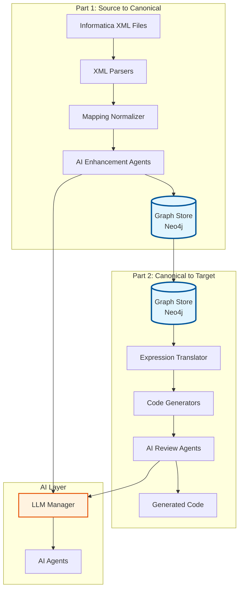

# Informatica Modernization Accelerator - Solution Overview

## Overview

The **Informatica Modernization Accelerator** is an AI-augmented platform that reverse-engineers legacy Informatica ETL workloads and modernizes them into lakehouse-native architectures (PySpark, Delta Live Tables, SQL on Databricks/Spark).

The system follows a **two-part architecture** with a **graph-first storage** approach:

### Part 1: Source to Canonical Form
```
Informatica XML
    ↓
Parser → Python Dict
    ↓
Normalizer → Canonical Model (Python Dict)
    ↓
AI Enhancement Agents → Enhanced Canonical Model
    ↓
Graph Store (Neo4j) ← PRIMARY STORAGE
```

### Part 2: Canonical Form to Target Stack
```
Graph Store (Neo4j) → Load Enhanced Model
    ↓
Translators → Translate Expressions
    ↓
Code Generators → Generate Target Code (Databricks today, extensible tomorrow)
    ↓
AI Review Agents → Review & Fix Code
    ↓
Final Code → Target Platform
```

### Graph Store as Central Hub

The **Graph Store (Neo4j)** serves as the **central repository** for canonical models, positioned between:
- **Part 1**: Where canonical models are created and enhanced
- **Part 2**: Where canonical models are consumed for code generation

**Benefits**:
- ✅ Single source of truth for canonical models
- ✅ Cross-mapping lineage and relationships
- ✅ Impact analysis across mappings
- ✅ Pattern discovery and reuse
- ✅ Extensible to future target platforms

---

## Architecture Layers

### 1. Deterministic Layer

Core parsing, normalization, translation, and code generation components that produce reliable, reproducible outputs.

#### Parsers (`src/parser/`)
- Extract structured data from Informatica XML files
- Handle Mapping, Workflow, Session, and Worklet XML formats
- Resolve cross-references between objects

#### Normalizer (`src/normalizer/`)
- Convert raw parsed data into technology-neutral canonical model
- Build complete data lineage (field-level and transformation-level)
- Detect SCD patterns (Type 1, Type 2, Type 3)
- Create single source of truth for all downstream processing

#### Translator (`src/translator/`)
- Translate Informatica expressions to target platform syntax
- Parse expressions into Abstract Syntax Trees (AST)
- Translate 100+ Informatica functions to PySpark/SQL equivalents

#### Generators (`src/generators/`)
- Generate executable code from canonical models
- Support PySpark, Delta Live Tables, SQL, Specifications, Tests
- Produce idiomatic code for target platforms

#### DAG Builder (`src/dag/`)
- Build execution graphs for workflows
- Perform topological sorting
- Detect cycles and dependencies
- Support visualization

### 2. AI/LLM Layer

Intelligent agents that provide explanations, analysis, suggestions, and reasoning capabilities.

#### LLM Infrastructure (`src/llm/`)
- Unified interface to multiple LLM providers (OpenAI, Azure, Local)
- Prompt templates for all agents
- Retry logic and error handling
- Fallback mechanisms

#### AI Agents (`ai_agents/`)

**Enhancement Agents** (Part 1):
- `ModelEnhancementAgent`: Enhances canonical model with AI insights
  - Pattern-based enhancements (fast, deterministic)
  - LLM-based enhancements (comprehensive, optional)
  - Metadata completion, optimization hints, data quality rules
- `ModelValidationAgent`: Validates enhanced canonical model

**Core Analysis Agents**:
- `RuleExplainerAgent`: Explains Informatica expressions in business terms
- `MappingSummaryAgent`: Generates comprehensive narrative summaries
- `RiskDetectionAgent`: Identifies potential issues and risks
- `TransformationSuggestionAgent`: Suggests optimizations and modernizations

**Advanced Agents**:
- `CodeReviewAgent`: Reviews generated code for issues and improvements
- `CodeFixAgent`: Automatically fixes errors in generated code
- `ImpactAnalysisAgent`: Analyzes downstream impact of changes
- `MappingReconstructionAgent`: Reconstructs mappings from partial information
- `WorkflowSimulationAgent`: Simulates execution and identifies bottlenecks

**Orchestration**:
- `AgentOrchestrator`: Coordinates multiple agents with error handling and caching

### 3. Graph Storage Layer

#### Graph Store (`src/graph/`)
- `GraphStore`: Neo4j-based storage for canonical models
- `GraphQueries`: High-level query methods for lineage, dependencies, impact analysis
- `GraphSync`: Dual-write mechanism (JSON + Graph) for compatibility

**Key Features**:
- Graph-first storage (Neo4j as primary)
- JSON export for backup/compatibility
- Cross-mapping queries
- Pattern discovery
- Migration readiness assessment

### 4. Infrastructure Layer

#### API Layer (`src/api/`)
- RESTful API for programmatic access
- File upload and management
- Orchestrates parsing, generation, and AI analysis
- Graph query endpoints

#### Version Store (`src/versioning/`)
- Stores canonical models (graph-first or JSON)
- Versions generated artifacts
- Enables regeneration from stored models

---

## System Flow

### Complete End-to-End Flow



### Detailed Stage Flow

#### Stage 1: File Upload and Parsing
```
User uploads XML file
    ↓
File Manager saves file
    ↓
Parser extracts structured data
    ↓
Raw parsed data (Python dictionaries)
```

#### Stage 2: Normalization and Canonical Model Creation
```
Raw parsed data
    ↓
MappingNormalizer normalizes transformations
    ↓
LineageEngine builds data lineage
    ↓
SCDDetector detects Slowly Changing Dimensions
    ↓
Canonical Model created
```

#### Stage 3: AI Enhancement (Part 1)
```
Canonical Model
    ↓
ModelEnhancementAgent enhances model
    ├── Pattern-based enhancements (fast)
    └── LLM-based enhancements (optional)
    ↓
ModelValidationAgent validates enhanced model
    ↓
Enhanced Canonical Model
    ↓
Saved to Graph Store (Neo4j)
```

#### Stage 4: Expression Translation
```
Canonical Model (from Graph)
    ↓
ParserEngine parses expressions into AST
    ↓
PySparkTranslator / SQLTranslator translates AST
    ↓
Translated expressions ready for code generation
```

#### Stage 5: Code Generation
```
Canonical Model + Translated Expressions
    ↓
Generator (PySpark/DLT/SQL/Spec/Tests) generates code
    ↓
Complete executable code files
```

#### Stage 6: AI Code Review (Part 2)
```
Generated Code
    ↓
CodeReviewAgent reviews code
    ├── Pattern-based review (fast)
    └── LLM-based review (comprehensive)
    ↓
If issues found:
    ↓
CodeFixAgent fixes code
    ↓
Final Code
```

#### Stage 7: AI Analysis (Parallel)
```
Canonical Model
    ↓
AgentOrchestrator coordinates agents
    ↓
┌─────────────────────────────────────┐
│  Core Agents (can run in parallel)  │
├─────────────────────────────────────┤
│ • RuleExplainerAgent                 │
│ • MappingSummaryAgent                │
│ • RiskDetectionAgent                 │
│ • TransformationSuggestionAgent      │
└─────────────────────────────────────┘
    ↓
Aggregated analysis results
```

---

## Key Design Principles

1. **Separation of Concerns**: Deterministic components handle critical path; AI agents provide enhancements
2. **Graph-First Storage**: Neo4j is primary storage for canonical models
3. **Canonical Model as Single Source of Truth**: All downstream processing uses the canonical model
4. **Two-Part Architecture**: Clear separation between source-to-canonical and canonical-to-target
5. **AI Enhancement Before Generation**: AI improves model before code generation
6. **AI Review After Generation**: AI reviews and fixes code after generation
7. **Modularity**: Each component is independent and replaceable
8. **Extensibility**: Easy to add new parsers, generators, or agents
9. **LLM-Optional**: System works without LLM, but is significantly enhanced with it
10. **Error Handling**: Graceful degradation at each layer

---

## Component Responsibilities

### Deterministic Components

| Component | Responsibility | Output |
|-----------|---------------|--------|
| **Parsers** | Extract structured data from XML | Raw parsed data (Python dicts) |
| **Normalizer** | Create canonical model | Canonical Model (JSON) |
| **Translator** | Translate expressions | Translated expressions (PySpark/SQL) |
| **Generators** | Generate executable code | Code files (Python, SQL, etc.) |
| **DAG Builder** | Build execution graphs | DAG structure (JSON, Mermaid) |

### AI Components

| Component | Responsibility | Output |
|-----------|---------------|--------|
| **ModelEnhancementAgent** | Enhance canonical model | Enhanced Canonical Model |
| **ModelValidationAgent** | Validate enhanced model | Validation results |
| **CodeReviewAgent** | Review generated code | Review results (issues, score) |
| **CodeFixAgent** | Fix code errors | Fixed code |
| **RuleExplainerAgent** | Explain expressions | Business-friendly explanations |
| **MappingSummaryAgent** | Summarize mappings | Narrative summaries |
| **RiskDetectionAgent** | Detect risks | Risk analysis |
| **TransformationSuggestionAgent** | Suggest optimizations | Optimization suggestions |

### Infrastructure Components

| Component | Responsibility | Output |
|-----------|---------------|--------|
| **GraphStore** | Store canonical models in Neo4j | Graph nodes and relationships |
| **GraphQueries** | Query graph for analysis | Query results |
| **VersionStore** | Version control for models | Versioned models |
| **API Layer** | RESTful API interface | JSON responses |

---

## Data Flow Summary

1. **XML → Parsed Data**: XML parsers extract structured information
2. **Parsed Data → Canonical Model**: Normalization ensures consistency and builds lineage
3. **Canonical Model → Enhanced Model**: AI agents enhance with metadata and optimizations
4. **Enhanced Model → Graph Store**: Saved to Neo4j as primary storage
5. **Graph Store → Code Generation**: Load from graph and generate code
6. **Generated Code → Reviewed Code**: AI agents review and fix code
7. **Canonical Model → AI Insights**: Agents provide analysis and recommendations (parallel)

---

## Extension Points

1. **New Parser**: Add parser class in `src/parser/`
2. **New Generator**: Add generator class in `src/generators/`
3. **New AI Agent**: Add agent class in `ai_agents/` and register in orchestrator
4. **New LLM Provider**: Add client in `src/llm/` and register in LLM Manager
5. **New Transformation Type**: Extend normalizer and generators
6. **New Target Platform**: Add generator extending platform abstraction

---

## Configuration

### Graph Store Configuration

```bash
# Neo4j Configuration (Required for graph-first)
NEO4J_URI=bolt://localhost:7687
NEO4J_USER=neo4j
NEO4J_PASSWORD=password

# Graph Store Configuration
ENABLE_GRAPH_STORE=true
GRAPH_FIRST=true
```

### LLM Configuration

```bash
# LLM Provider
LLM_PROVIDER=openai  # or azure, local

# OpenAI
OPENAI_API_KEY=your_key
OPENAI_MODEL=gpt-4o-mini

# Azure OpenAI
AZURE_OPENAI_ENDPOINT=https://your-resource.openai.azure.com/
AZURE_OPENAI_KEY=your_key
AZURE_OPENAI_DEPLOYMENT=your_deployment
```

---

## Benefits of Graph-First Architecture

1. **Single Source of Truth**: Canonical models stored in Neo4j
2. **Cross-Mapping Capabilities**: Find all mappings using a table, trace dependencies
3. **Impact Analysis**: Understand downstream effects of changes
4. **Pattern Discovery**: Discover reusable patterns across mappings
5. **Extensibility**: Easy to add new target platforms
6. **Performance**: Fast relationship queries, efficient traversal
7. **Knowledge Graph**: Build enterprise-wide lineage

---

---

## Detailed Process Documentation

### Parse & Enhance Step - File Processing Details

#### What Files Are Parsed?

The **Parse & Enhance** step processes **all Informatica component types**, not just mappings:

**Supported Component Types:**

1. **Mappings** (`mapping`)
   - **Purpose**: Extract transformation logic, sources, targets, expressions
   - **Output**: Creates canonical model (technology-neutral representation)
   - **Enhancement**: AI enhancement adds metadata, optimization hints, data quality rules
   - **Storage**: Saved to Neo4j graph database

2. **Workflows** (`workflow`)
   - **Purpose**: Extract task execution order, dependencies, scheduling
   - **Output**: Creates workflow DAG (Directed Acyclic Graph) structure
   - **Enhancement**: Workflow-level analysis and optimization suggestions
   - **Storage**: Stored separately from canonical model (workflow orchestration data)

3. **Sessions** (`session`)
   - **Purpose**: Extract session configuration, mapping references, connection details
   - **Output**: Session configuration and metadata
   - **Enhancement**: Configuration optimization suggestions
   - **Storage**: Linked to workflows and mappings in graph

4. **Worklets** (`worklet`)
   - **Purpose**: Extract reusable workflow components and embedded tasks
   - **Output**: Worklet structure and relationships
   - **Enhancement**: Reusability analysis and pattern detection
   - **Storage**: Linked to workflows in graph

#### Processing Flow

```
Upload XML File
    ↓
File Type Detection (mapping/workflow/session/worklet)
    ↓
┌─────────────────────────────────────────┐
│  Type-Specific Parser                   │
├─────────────────────────────────────────┤
│  • Mapping → MappingParser              │
│  • Workflow → WorkflowParser            │
│  • Session → SessionParser              │
│  • Worklet → WorkletParser              │
└─────────────────────────────────────────┘
    ↓
Raw Parsed Data (Python Dictionary)
    ↓
┌─────────────────────────────────────────┐
│  For Mappings Only:                     │
│  Normalization → Canonical Model         │
│  ↓                                       │
│  AI Enhancement (optional)               │
│  ↓                                       │
│  Save to Neo4j                          │
├─────────────────────────────────────────┤
│  For Other Types:                       │
│  Store as hierarchy/orchestration data  │
│  Link to mappings in graph              │
└─────────────────────────────────────────┘
```

**Important Notes**:
- ✅ **All component types are parsed** (mapping, workflow, session, worklet)
- ✅ **Only mappings create canonical models** (technology-neutral representation)
- ✅ **Workflows/sessions/worklets create orchestration structures** (DAGs, configs)
- ✅ **All components are stored in Neo4j** with appropriate relationships
- ✅ **AI enhancement is primarily applied to mappings** (canonical models)

---

### Canonical Model - Components and Neo4j Schema

#### What Is Included in the Canonical Model?

The canonical model is a **technology-neutral, standardized JSON representation** that serves as the single source of truth for all downstream processing.

**Components Included:**

1. **Mapping Structure**
   - Mapping name and metadata
   - Source definitions (tables, files, connections)
   - Target definitions (tables, files, write strategies)
   - Transformation list (all transformation objects)
   - Connection graph (data flow between transformations)

2. **Transformation Details**
   - Transformation type (EXPRESSION, LOOKUP, AGGREGATOR, JOINER, ROUTER, FILTER, UNION, etc.)
   - Input ports (field definitions, data types)
   - Output ports (derived fields, expressions)
   - Expressions and formulas (Informatica syntax)
   - Configuration parameters (lookup conditions, join keys, etc.)

3. **Lineage Information**
   - Column-level lineage (which source columns feed each derived field)
   - Transformation-level lineage (data flow: SQ → EXP → LKUP → AGG → TARGET)
   - Field-to-field relationships (derived_from, flows_to)

4. **Metadata**
   - Names, descriptions, annotations
   - SCD type detection (Type 1, Type 2, Type 3)
   - Incremental load keys
   - Business rules and constraints

5. **AI Enhancement Metadata** (optional, added during enhancement)
   - `_optimization_hint`: Performance optimization suggestions
   - `_data_quality_rules`: Data quality constraints
   - `_performance_metadata`: Performance characteristics
   - `_provenance`: Tracking of enhancements applied

#### What Components Are Modeled in Neo4j?

**All Informatica components are modeled in Neo4j**, but with different purposes:

**Primary Components (Mappings - Canonical Model):**
- **Mapping**: Core ETL logic representation
- **Transformation**: Individual transformation objects
- **Source**: Source table/file definitions
- **Target**: Target table/file definitions
- **Field**: Column/field definitions with lineage
- **Connector**: Data flow connections between transformations

**Orchestration Components (Workflows/Sessions/Worklets):**
- **Workflow**: Workflow execution structure
- **Session**: Session configuration and mapping references
- **Worklet**: Reusable workflow components
- **Table**: Physical table definitions
- **Database**: Database/platform definitions

#### Neo4j Data Model/Schema

The Neo4j schema supports **all components** with a comprehensive relationship model:

**Node Types:**
```
Mapping
├── name: "M_LOAD_CUSTOMER"
├── type: "MAPPING"
├── mapping_name: "M_LOAD_CUSTOMER"
└── properties: {metadata, scd_type, ...}

Transformation
├── name: "EXP_CALCULATE_TOTAL"
├── type: "EXPRESSION"
├── mapping: "M_LOAD_CUSTOMER"
└── properties: {optimization_hint, ...}

Source
├── name: "SQ_CUSTOMER"
├── type: "SOURCE"
├── table: "CUSTOMER_SRC"
└── database: "source_db"

Target
├── name: "TGT_CUSTOMER"
├── type: "TARGET"
├── table: "CUSTOMER_TGT"
└── database: "lakehouse_db"

Field
├── name: "CUSTOMER_ID"
├── type: "FIELD"
├── data_type: "STRING"
└── parent: "SQ_CUSTOMER"

Workflow
├── name: "WF_CUSTOMER_DAILY"
├── type: "WORKFLOW"
└── schedule: {...}

Session
├── name: "S_M_LOAD_CUSTOMER"
├── type: "SESSION"
├── mapping: "M_LOAD_CUSTOMER"
└── workflow: "WF_CUSTOMER_DAILY"

Table
├── name: "CUSTOMER_SRC"
├── type: "TABLE"
├── database: "source_db"
└── schema: {...}

Database
├── name: "source_db"
├── type: "DATABASE"
└── platform: "Oracle"
```

**Relationship Types:**
```
(Mapping)-[:HAS_TRANSFORMATION]->(Transformation)
(Mapping)-[:HAS_SOURCE]->(Source)
(Mapping)-[:HAS_TARGET]->(Target)
(Transformation)-[:CONNECTS_TO]->(Transformation)
(Transformation)-[:READS_FROM]->(Source)
(Transformation)-[:WRITES_TO]->(Target)
(Field)-[:FLOWS_TO]->(Field)
(Field)-[:DERIVED_FROM]->(Field)
(Mapping)-[:USES_TABLE]->(Table)
(Source)-[:READS_TABLE]->(Table)
(Target)-[:WRITES_TABLE]->(Table)
(Workflow)-[:CONTAINS]->(Session)
(Session)-[:EXECUTES]->(Mapping)
(Mapping)-[:DEPENDS_ON]->(Mapping)
(Transformation)-[:SIMILAR_TO]->(Transformation)
(Table)-[:FEEDS_INTO]->(Table)
```

**Neo4j Schema Capabilities:**
- ✅ **All components are modeled**: Mappings, workflows, sessions, worklets, tables, databases
- ✅ **Comprehensive relationships**: Full lineage, dependencies, and orchestration links
- ✅ **Cross-mapping queries**: Find all mappings using a table, trace dependencies
- ✅ **Impact analysis**: Understand downstream effects of changes
- ✅ **Pattern discovery**: Discover reusable patterns across mappings

---

### Code Generation - Process and Dependencies

#### What Does Code Generation Use?

Code generation **primarily uses the canonical model** as the single source of truth, with **no dependency on source mapping XML files** after parsing.

**Primary Input: Canonical Model**
```
Canonical Model (from Neo4j or JSON)
    ↓
Expression Translation (Informatica → PySpark/SQL)
    ↓
Code Generator (PySpark/DLT/SQL)
    ↓
Generated Code Files
```

#### Code Generation Process:

1. **Load Canonical Model**
   - Load from Neo4j graph database (primary)
   - Or load from JSON file (backup/compatibility)
   - **No access to original XML files needed**

2. **Expression Translation**
   - Parse Informatica expressions into AST (Abstract Syntax Tree)
   - Translate AST to target platform syntax (PySpark/SQL)
   - Map 100+ Informatica functions to PySpark/SQL equivalents
   - **Uses only canonical model expressions**

3. **Code Generation**
   - Generate source table reads
   - Generate transformation logic (joins, lookups, aggregations, expressions)
   - Generate target table writes
   - Generate complete executable pipelines
   - **Uses only canonical model structure**

#### What Gets Generated:

**For each mapping, code generation produces:**

1. **Complete PySpark Code**
   - SparkSession initialization
   - Source table reads (`spark.table()` or `spark.read()`)
   - Transformation DataFrame operations
   - Target table writes (`df.write.format('delta').saveAsTable()`)
   - All expressions translated to PySpark syntax

2. **Delta Live Tables (DLT) Code**
   - `@dlt.table` function definitions
   - Incremental load semantics (if SCD detected)
   - Dependencies between tables (`spark.table()` or `dlt.read()`)
   - Complete DLT pipeline

3. **SQL Code**
   - SELECT statements with transformations
   - WITH clauses for intermediate results
   - Target views or CTAS-style statements
   - Complete SQL scripts

**Key Points**:
- ✅ **Uses only canonical model** - no XML files needed
- ✅ **Regeneration is straightforward** - just reload model and regenerate
- ✅ **Technology independence** - model is not tied to Informatica or target platforms
- ✅ **Single source of truth** - all generators work from the same model

#### Does Code Generation Detect Reusable Code/Libraries?

**Current Implementation**: Code generation produces **mapping-specific code** for each mapping. Reusability detection is handled separately by AI agents and graph analysis.

**Reusability Detection Mechanisms:**

1. **Pattern Detection** (via Graph Analysis)
   - Neo4j queries identify similar transformations across mappings
   - Pattern matching: `(Transformation)-[:SIMILAR_TO]->(Transformation)`
   - Identifies reusable transformation patterns

2. **AI Agent Analysis** (via TransformationSuggestionAgent)
   - Analyzes canonical models for common patterns
   - Suggests extraction of reusable functions
   - Identifies library candidates

3. **Manual Post-Processing** (Future Enhancement)
   - Generated code can be refactored to extract common functions
   - Shared libraries can be created from detected patterns
   - Code review agents can suggest refactoring opportunities

**Current Code Generation Approach:**
- **Per-Mapping Generation**: Each mapping generates **standalone code**
- **Code is self-contained** and **executable**
- **No automatic library extraction** (by design for clarity)
- **Reusability via Graph**: Graph queries identify similar patterns, AI agents suggest refactoring opportunities, manual extraction of common code into libraries

---

## Related Documentation

- **Architecture Diagrams**: See `docs/architecture/` for visual diagrams
- **System Architecture**: See `docs/architecture/system_architecture.md` for detailed architecture
- **Canonical Model**: See `docs/modules/canonical_model.md` for model structure
- **API Documentation**: See API endpoints in `src/api/routes.py`
- **Testing Guide**: See `docs/testing/TESTING.md` for testing instructions
- **Roadmap**: See `docs/reference/roadmap.md` for implementation status

---

This architecture ensures that the system is both **reliable** (deterministic components) and **intelligent** (AI agents), with a **graph-first storage** approach that enables powerful cross-mapping analysis and extensibility.

