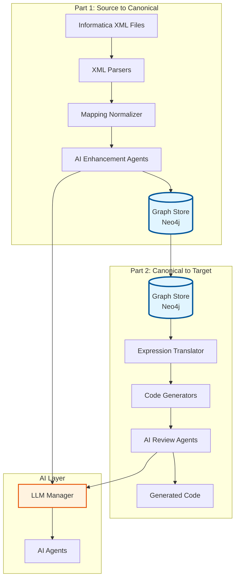

# Informatica Modernization Accelerator - Solution Overview

## Overview

The **Informatica Modernization Accelerator** is an AI-augmented platform that reverse-engineers legacy Informatica ETL workloads and modernizes them into lakehouse-native architectures (PySpark, Delta Live Tables, SQL on Databricks/Spark).

The system follows a **two-part architecture** with a **graph-first storage** approach:

### Part 1: Source to Canonical Form
```
Informatica XML
    ↓
Parser → Python Dict
    ↓
Normalizer → Canonical Model (Python Dict)
    ↓
AI Enhancement Agents → Enhanced Canonical Model
    ↓
Graph Store (Neo4j) ← PRIMARY STORAGE
```

### Part 2: Canonical Form to Target Stack
```
Graph Store (Neo4j) → Load Enhanced Model
    ↓
Translators → Translate Expressions
    ↓
Code Generators → Generate Target Code (Databricks today, extensible tomorrow)
    ↓
AI Review Agents → Review & Fix Code
    ↓
Final Code → Target Platform
```

### Graph Store as Central Hub

The **Graph Store (Neo4j)** serves as the **central repository** for canonical models, positioned between:
- **Part 1**: Where canonical models are created and enhanced
- **Part 2**: Where canonical models are consumed for code generation

**Benefits**:
- ✅ Single source of truth for canonical models
- ✅ Cross-mapping lineage and relationships
- ✅ Impact analysis across mappings
- ✅ Pattern discovery and reuse
- ✅ Extensible to future target platforms

---

## Architecture Layers

### 1. Deterministic Layer

Core parsing, normalization, translation, and code generation components that produce reliable, reproducible outputs.

#### Parsers (`src/parser/`)
- Extract structured data from Informatica XML files
- Handle Mapping, Workflow, Session, and Worklet XML formats
- Resolve cross-references between objects

#### Normalizer (`src/normalizer/`)
- Convert raw parsed data into technology-neutral canonical model
- Build complete data lineage (field-level and transformation-level)
- Detect SCD patterns (Type 1, Type 2, Type 3)
- Create single source of truth for all downstream processing

#### Translator (`src/translator/`)
- Translate Informatica expressions to target platform syntax
- Parse expressions into Abstract Syntax Trees (AST)
- Translate 100+ Informatica functions to PySpark/SQL equivalents

#### Generators (`src/generators/`)
- Generate executable code from canonical models
- Support PySpark, Delta Live Tables, SQL, Specifications, Tests
- Produce idiomatic code for target platforms

#### DAG Builder (`src/dag/`)
- Build execution graphs for workflows
- Perform topological sorting
- Detect cycles and dependencies
- Support visualization

### 2. AI/LLM Layer

Intelligent agents that provide explanations, analysis, suggestions, and reasoning capabilities.

#### LLM Infrastructure (`src/llm/`)
- Unified interface to multiple LLM providers (OpenAI, Azure, Local)
- Prompt templates for all agents
- Retry logic and error handling
- Fallback mechanisms

#### AI Agents (`ai_agents/`)

**Enhancement Agents** (Part 1):
- `ModelEnhancementAgent`: Enhances canonical model with AI insights
  - Pattern-based enhancements (fast, deterministic)
  - LLM-based enhancements (comprehensive, optional)
  - Metadata completion, optimization hints, data quality rules
- `ModelValidationAgent`: Validates enhanced canonical model

**Core Analysis Agents**:
- `RuleExplainerAgent`: Explains Informatica expressions in business terms
- `MappingSummaryAgent`: Generates comprehensive narrative summaries
- `RiskDetectionAgent`: Identifies potential issues and risks
- `TransformationSuggestionAgent`: Suggests optimizations and modernizations

**Advanced Agents**:
- `CodeReviewAgent`: Reviews generated code for issues and improvements
- `CodeFixAgent`: Automatically fixes errors in generated code
- `ImpactAnalysisAgent`: Analyzes downstream impact of changes
- `MappingReconstructionAgent`: Reconstructs mappings from partial information
- `WorkflowSimulationAgent`: Simulates execution and identifies bottlenecks

**Orchestration**:
- `AgentOrchestrator`: Coordinates multiple agents with error handling and caching

### 3. Graph Storage Layer

#### Graph Store (`src/graph/`)
- `GraphStore`: Neo4j-based storage for canonical models
- `GraphQueries`: High-level query methods for lineage, dependencies, impact analysis
- `GraphSync`: Dual-write mechanism (JSON + Graph) for compatibility

**Key Features**:
- Graph-first storage (Neo4j as primary)
- JSON export for backup/compatibility
- Cross-mapping queries
- Pattern discovery
- Migration readiness assessment

### 4. Infrastructure Layer

#### API Layer (`src/api/`)
- RESTful API for programmatic access
- File upload and management
- Orchestrates parsing, generation, and AI analysis
- Graph query endpoints

#### Version Store (`src/versioning/`)
- Stores canonical models (graph-first or JSON)
- Versions generated artifacts
- Enables regeneration from stored models

---

## System Flow

### Complete End-to-End Flow



### Detailed Stage Flow

#### Stage 1: File Upload and Parsing
```
User uploads XML file
    ↓
File Manager saves file
    ↓
Parser extracts structured data
    ↓
Raw parsed data (Python dictionaries)
```

#### Stage 2: Normalization and Canonical Model Creation
```
Raw parsed data
    ↓
MappingNormalizer normalizes transformations
    ↓
LineageEngine builds data lineage
    ↓
SCDDetector detects Slowly Changing Dimensions
    ↓
Canonical Model created
```

#### Stage 3: AI Enhancement (Part 1)
```
Canonical Model
    ↓
ModelEnhancementAgent enhances model
    ├── Pattern-based enhancements (fast)
    └── LLM-based enhancements (optional)
    ↓
ModelValidationAgent validates enhanced model
    ↓
Enhanced Canonical Model
    ↓
Saved to Graph Store (Neo4j)
```

#### Stage 4: Expression Translation
```
Canonical Model (from Graph)
    ↓
ParserEngine parses expressions into AST
    ↓
PySparkTranslator / SQLTranslator translates AST
    ↓
Translated expressions ready for code generation
```

#### Stage 5: Code Generation
```
Canonical Model + Translated Expressions
    ↓
Generator (PySpark/DLT/SQL/Spec/Tests) generates code
    ↓
Complete executable code files
```

#### Stage 6: AI Code Review (Part 2)
```
Generated Code
    ↓
CodeReviewAgent reviews code
    ├── Pattern-based review (fast)
    └── LLM-based review (comprehensive)
    ↓
If issues found:
    ↓
CodeFixAgent fixes code
    ↓
Final Code
```

#### Stage 7: AI Analysis (Parallel)
```
Canonical Model
    ↓
AgentOrchestrator coordinates agents
    ↓
┌─────────────────────────────────────┐
│  Core Agents (can run in parallel)  │
├─────────────────────────────────────┤
│ • RuleExplainerAgent                 │
│ • MappingSummaryAgent                │
│ • RiskDetectionAgent                 │
│ • TransformationSuggestionAgent      │
└─────────────────────────────────────┘
    ↓
Aggregated analysis results
```

---

## Key Design Principles

1. **Separation of Concerns**: Deterministic components handle critical path; AI agents provide enhancements
2. **Graph-First Storage**: Neo4j is primary storage for canonical models
3. **Canonical Model as Single Source of Truth**: All downstream processing uses the canonical model
4. **Two-Part Architecture**: Clear separation between source-to-canonical and canonical-to-target
5. **AI Enhancement Before Generation**: AI improves model before code generation
6. **AI Review After Generation**: AI reviews and fixes code after generation
7. **Modularity**: Each component is independent and replaceable
8. **Extensibility**: Easy to add new parsers, generators, or agents
9. **LLM-Optional**: System works without LLM, but is significantly enhanced with it
10. **Error Handling**: Graceful degradation at each layer

---

## Component Responsibilities

### Deterministic Components

| Component | Responsibility | Output |
|-----------|---------------|--------|
| **Parsers** | Extract structured data from XML | Raw parsed data (Python dicts) |
| **Normalizer** | Create canonical model | Canonical Model (JSON) |
| **Translator** | Translate expressions | Translated expressions (PySpark/SQL) |
| **Generators** | Generate executable code | Code files (Python, SQL, etc.) |
| **DAG Builder** | Build execution graphs | DAG structure (JSON, Mermaid) |

### AI Components

| Component | Responsibility | Output |
|-----------|---------------|--------|
| **ModelEnhancementAgent** | Enhance canonical model | Enhanced Canonical Model |
| **ModelValidationAgent** | Validate enhanced model | Validation results |
| **CodeReviewAgent** | Review generated code | Review results (issues, score) |
| **CodeFixAgent** | Fix code errors | Fixed code |
| **RuleExplainerAgent** | Explain expressions | Business-friendly explanations |
| **MappingSummaryAgent** | Summarize mappings | Narrative summaries |
| **RiskDetectionAgent** | Detect risks | Risk analysis |
| **TransformationSuggestionAgent** | Suggest optimizations | Optimization suggestions |

### Infrastructure Components

| Component | Responsibility | Output |
|-----------|---------------|--------|
| **GraphStore** | Store canonical models in Neo4j | Graph nodes and relationships |
| **GraphQueries** | Query graph for analysis | Query results |
| **VersionStore** | Version control for models | Versioned models |
| **API Layer** | RESTful API interface | JSON responses |

---

## Data Flow Summary

1. **XML → Parsed Data**: XML parsers extract structured information
2. **Parsed Data → Canonical Model**: Normalization ensures consistency and builds lineage
3. **Canonical Model → Enhanced Model**: AI agents enhance with metadata and optimizations
4. **Enhanced Model → Graph Store**: Saved to Neo4j as primary storage
5. **Graph Store → Code Generation**: Load from graph and generate code
6. **Generated Code → Reviewed Code**: AI agents review and fix code
7. **Canonical Model → AI Insights**: Agents provide analysis and recommendations (parallel)

---

## Extension Points

1. **New Parser**: Add parser class in `src/parser/`
2. **New Generator**: Add generator class in `src/generators/`
3. **New AI Agent**: Add agent class in `ai_agents/` and register in orchestrator
4. **New LLM Provider**: Add client in `src/llm/` and register in LLM Manager
5. **New Transformation Type**: Extend normalizer and generators
6. **New Target Platform**: Add generator extending platform abstraction

---

## Configuration

### Graph Store Configuration

```bash
# Neo4j Configuration (Required for graph-first)
NEO4J_URI=bolt://localhost:7687
NEO4J_USER=neo4j
NEO4J_PASSWORD=password

# Graph Store Configuration
ENABLE_GRAPH_STORE=true
GRAPH_FIRST=true
```

### LLM Configuration

```bash
# LLM Provider
LLM_PROVIDER=openai  # or azure, local

# OpenAI
OPENAI_API_KEY=your_key
OPENAI_MODEL=gpt-4o-mini

# Azure OpenAI
AZURE_OPENAI_ENDPOINT=https://your-resource.openai.azure.com/
AZURE_OPENAI_KEY=your_key
AZURE_OPENAI_DEPLOYMENT=your_deployment
```

---

## Benefits of Graph-First Architecture

1. **Single Source of Truth**: Canonical models stored in Neo4j
2. **Cross-Mapping Capabilities**: Find all mappings using a table, trace dependencies
3. **Impact Analysis**: Understand downstream effects of changes
4. **Pattern Discovery**: Discover reusable patterns across mappings
5. **Extensibility**: Easy to add new target platforms
6. **Performance**: Fast relationship queries, efficient traversal
7. **Knowledge Graph**: Build enterprise-wide lineage

---

## Related Documentation

- **Architecture Diagrams**: See `docs/architecture/` for visual diagrams
- **Canonical Model**: See `docs/canonical_model.md` for model structure
- **API Documentation**: See API endpoints in `src/api/routes.py`
- **Testing Guide**: See `test_end_to_end.md` for testing instructions
- **Roadmap**: See `roadmap.md` for implementation status

---

This architecture ensures that the system is both **reliable** (deterministic components) and **intelligent** (AI agents), with a **graph-first storage** approach that enables powerful cross-mapping analysis and extensibility.

